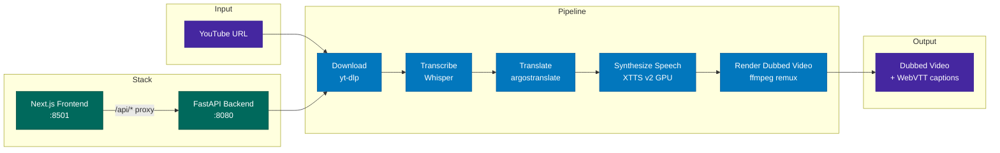

# Foreign Whispers

[](./LICENSE)

YouTube video dubbing pipeline — transcribe, translate, and dub 60 Minutes interviews into Spanish.

## Architecture



## Quick Start

Three hardware profiles are available via Docker Compose:

```bash
# NVIDIA GPU — Whisper + XTTS on GPU, full pipeline
docker compose --profile nvidia up -d

# x86 CPU — all inference on CPU (slower)
docker compose --profile cpu up -d

# Apple Silicon — CPU with MPS fallback
docker compose --profile apple up -d
```

Open **http://localhost:8501** in your browser.

## Pipeline Stages

| Stage | What it does | Output |
|-------|-------------|--------|
| **Download** | Fetch video + captions from YouTube via yt-dlp | `pipeline_data/raw_video/`, `raw_caption/` |
| **Transcribe** | Speech-to-text via Whisper | `pipeline_data/raw_transcription/` |
| **Translate** | English to Spanish via argostranslate (offline, OpenNMT) | `pipeline_data/translated_transcription/` |
| **Synthesize Speech** | TTS via XTTS v2 (GPU) or Coqui (CPU fallback), time-aligned to original segments | `pipeline_data/translated_audio/` |
| **Render Dubbed Video** | Replace audio track via ffmpeg remux (no re-encoding) | `pipeline_data/translated_video/` |

Captions are served as WebVTT via the `<track>` element — no subtitle burn-in:

| Endpoint | Source | Output |
|----------|--------|--------|
| `GET /api/captions/{id}/original` | YouTube captions (accurate timestamps) | `pipeline_data/original_captions/*.vtt` |
| `GET /api/captions/{id}` | Translated segments + YouTube timing offset | `pipeline_data/translated_captions/*.vtt` |

## Project Structure

```
foreign-whispers/
├── api/src/                     # FastAPI backend (layered architecture)
│   ├── main.py                  # App factory + lazy model loading
│   ├── core/config.py           # Pydantic settings (FW_ env prefix)
│   ├── routers/                 # Thin route handlers
│   │   ├── download.py          # POST /api/download
│   │   ├── transcribe.py        # POST /api/transcribe/{id}
│   │   ├── translate.py         # POST /api/translate/{id}
│   │   ├── tts.py               # POST /api/tts/{id}
│   │   └── stitch.py            # POST /api/stitch/{id}, GET /api/video/*, /api/captions/*
│   ├── services/                # Business logic (HTTP-agnostic)
│   ├── schemas/                 # Pydantic request/response models
│   └── inference/               # ML model backend abstraction
├── frontend/                    # Next.js + shadcn/ui
│   ├── src/components/          # Pipeline tracker, video player, result panels
│   ├── src/hooks/use-pipeline.ts # State machine for pipeline orchestration
│   └── src/lib/api.ts           # API client
├── download_video.py            # yt-dlp wrapper
├── transcribe.py                # Whisper wrapper
├── translate_en_to_es.py        # argostranslate wrapper
├── tts_es.py                    # XTTS client + time-aligned TTS generation
├── translated_output.py         # ffmpeg audio remux + legacy subtitle compositing
├── pipeline_data/               # All intermediate and output files (volume-mounted)
├── docker-compose.yml           # Profiles: nvidia, cpu, apple
├── Dockerfile                   # Multi-stage: cpu and gpu targets
└── docs/
    └── dubbing-alignment-design.md  # TTS temporal alignment literature survey + design
```

## API Endpoints

| Method | Endpoint | Description |
|--------|----------|-------------|
| POST | `/api/download` | Download YouTube video + captions |
| POST | `/api/transcribe/{id}` | Whisper speech-to-text |
| POST | `/api/translate/{id}` | English to Spanish translation |
| POST | `/api/tts/{id}` | Time-aligned TTS synthesis |
| POST | `/api/stitch/{id}` | Audio remux (ffmpeg -c:v copy) |
| GET | `/api/video/{id}` | Stream dubbed video (range requests) |
| GET | `/api/video/{id}/original` | Stream original video (range requests) |
| GET | `/api/captions/{id}` | Translated WebVTT captions |
| GET | `/api/captions/{id}/original` | Original English WebVTT captions |
| GET | `/api/audio/{id}` | TTS audio (WAV) |
| GET | `/healthz` | Health check |

## Development

```bash
# Local development (without Docker)
uv sync
uvicorn api.src.main:app --reload --port 8080

# Frontend
cd frontend && pnpm install && pnpm dev
```

Requirements:
- Python 3.11
- ffmpeg (system-wide)
- deno (for yt-dlp YouTube extraction)
- NVIDIA GPU recommended for Whisper + XTTS inference
