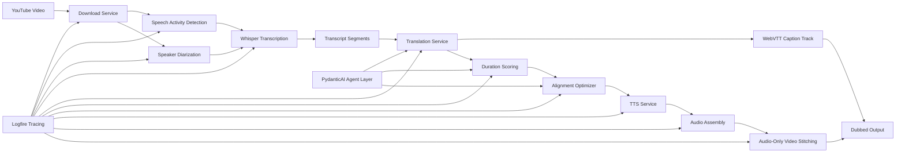
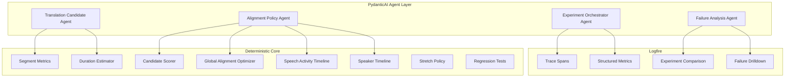
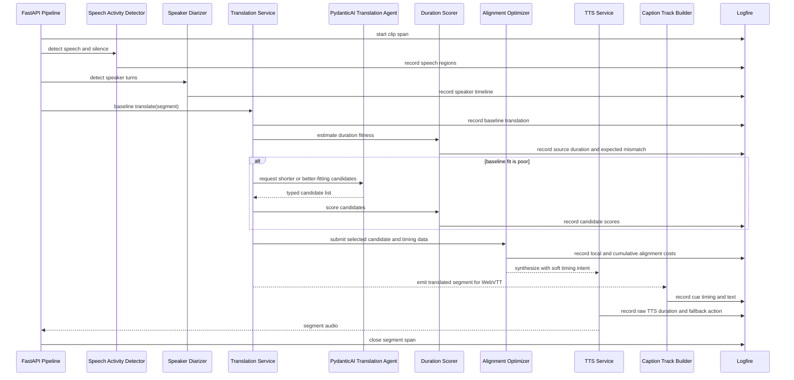
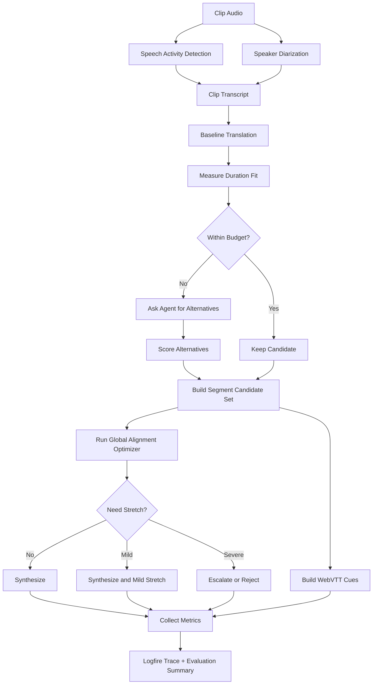
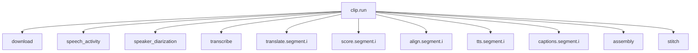
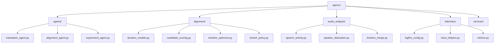
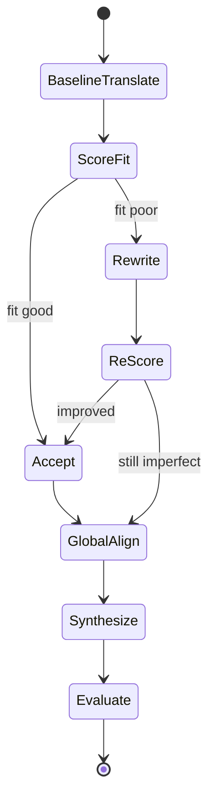

# PydanticAI and Logfire Architecture for Continuous Dubbing Optimization

**Date**: 2026-03-17  
**Status**: Draft for review

## Purpose

This document describes how to add PydanticAI agents and Logfire instrumentation to the existing Foreign Whispers pipeline without replacing the deterministic alignment and optimization logic.

The design goal is simple:

- keep timing, alignment, and scoring in explicit Python code
- use agents for bounded semantic decisions and experiment orchestration
- use Logfire to trace every decision across the pipeline

## Design Principles

### 1. Keep the objective function deterministic

The system should continue to compute duration error, distortion cost, overflow, slack, and cumulative drift in normal Python modules.

Agents should not replace:

- duration scoring
- timeline optimization
- stretch safety checks
- regression tests

Agents should consume those metrics and help with:

- candidate generation
- policy selection
- experiment planning
- trace analysis

### 2. Treat the agent as a typed decision layer

PydanticAI is useful here because the system already has clean service boundaries and structured payloads.

The agent should receive typed inputs such as:

- source segment text
- translated candidates
- target duration
- raw TTS duration estimates
- nearby gap budget
- policy thresholds

The agent should return typed outputs such as:

- chosen translation candidate
- retry request
- reason code
- confidence
- explanation

### 3. Instrument everything important

Logfire should record each step as a span with structured fields so you can inspect one segment, one clip, or one experiment run without guessing what happened.

## Proposed System Context

## Recommended Responsibility Split

## How PydanticAI Fits This Repository

The current codebase already exposes natural insertion points:

- the audio path before or around transcription for VAD and diarization
- [api/src/services/translation_service.py](/home/pantelis.monogioudis/local/ai/apps/computer-vision/auraison-app/foreign-whispers/api/src/services/translation_service.py)
- [api/src/services/tts_service.py](/home/pantelis.monogioudis/local/ai/apps/computer-vision/auraison-app/foreign-whispers/api/src/services/tts_service.py)
- [api/src/routers/stitch.py](/home/pantelis.monogioudis/local/ai/apps/computer-vision/auraison-app/foreign-whispers/api/src/routers/stitch.py)
- [tts_es.py](/home/pantelis.monogioudis/local/ai/apps/computer-vision/auraison-app/foreign-whispers/tts_es.py)
- [translated_output.py](/home/pantelis.monogioudis/local/ai/apps/computer-vision/auraison-app/foreign-whispers/translated_output.py)

The agent layer should sit above those modules, not inside the low-level waveform code.

## Proposed Agent Topology

### Agent 1: Translation Candidate Agent

This agent rewrites or proposes alternatives for a segment when the baseline translation is likely to violate the timing budget.

Inputs:

- source text
- baseline translation
- target language
- target duration
- style constraints
- previous and next segment context

Outputs:

- candidate list
- brevity rationale
- semantic risk note

### Agent 2: Alignment Policy Agent

This agent does not compute the optimal schedule itself. It chooses among actions exposed by deterministic code.

Inputs:

- speech activity regions
- speaker turns
- duration mismatch metrics
- candidate scores
- available silence gap
- local distortion cost
- cumulative drift so far

Outputs:

- prefer current translation
- request shorter translation
- allow gap shift
- allow mild stretch
- split around a turn boundary
- mark for manual review

### Agent 3: Experiment Orchestrator Agent

This agent runs repeated trials over a corpus and compares strategies.

Inputs:

- clip IDs
- policy variants
- summary metrics from Logfire

Outputs:

- ranked experiment summary
- notable failures
- recommendation for next policy change

### Agent 4: Failure Analysis Agent

This agent consumes traces after runs complete and clusters failure modes.

Inputs:

- Logfire trace data
- segment metrics
- selected actions
- final alignment outcomes

Outputs:

- failure category
- likely root cause
- suggested next change

## Sequence Diagram for One Segment

## Global Clip Optimization Loop

## Logfire Instrumentation Plan

Logfire should expose both traces and domain metrics.

### Trace hierarchy

### Recommended span fields

For each segment, record:

- `segment_index`
- `source_start`
- `source_end`
- `source_duration_ms`
- `source_text`
- `baseline_translation`
- `candidate_count`
- `selected_candidate`
- `predicted_duration_ms`
- `raw_tts_duration_ms`
- `stretch_factor`
- `gap_shift_ms`
- `cumulative_drift_ms`
- `speech_region_id`
- `speaker_id`
- `speaker_turn_conflict`
- `caption_cue_start_ms`
- `caption_cue_end_ms`
- `policy_action`
- `failure_code`

### Recommended aggregate metrics

For each clip, record:

- mean absolute duration error
- speech-region coverage accuracy
- speaker-turn continuity
- count of severe stretch events
- count of translation retries
- count of gap shifts
- total cumulative drift
- count of caption cues updated by alignment policy
- percent of segments resolved without stretch

## Suggested Package Layout

This is one reasonable structure if you add agent and telemetry support:

## Boundaries That Should Stay Strict

Do not let the agent:

- edit timestamps directly without going through the optimizer
- emit raw waveform manipulation instructions
- override test thresholds silently
- invent evaluation metrics

Do let the agent:

- propose text alternatives
- choose from exposed policy actions
- summarize tradeoffs
- recommend experiment next steps

## Example Control Loop

## Recommended Rollout Order

1. Add Logfire spans around the current deterministic pipeline.
2. Add speech activity detection and trace its outputs.
3. Add speaker diarization and trace its outputs.
4. Add segment metrics and clip summary metrics.
5. Add a PydanticAI translation candidate agent with typed outputs.
6. Add an alignment policy agent that only selects among deterministic actions.
7. Add experiment orchestration over a small benchmark set.
8. Use trace data to decide whether stronger TTS control is still needed.

## View

PydanticAI is strongest here when it is used to make constrained semantic decisions over a measurable optimization pipeline.

Logfire is strongest when every segment decision becomes traceable enough to answer:

- what options existed
- what they cost
- what the system chose
- whether that choice improved the final dub
- whether the same decision kept the WebVTT track coherent with the dubbed result

That combination gives you a pipeline that can improve continuously without collapsing into an opaque agent-driven system.
